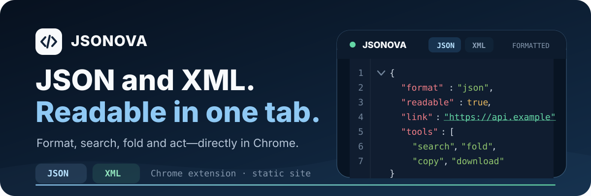
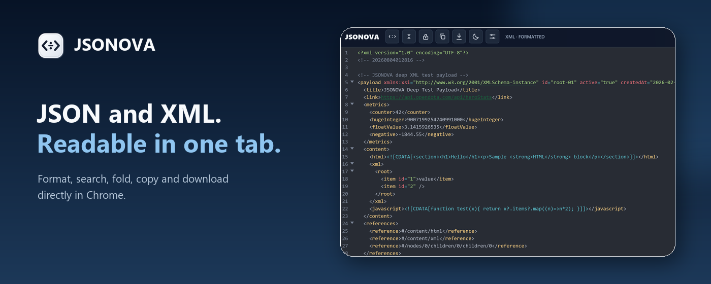
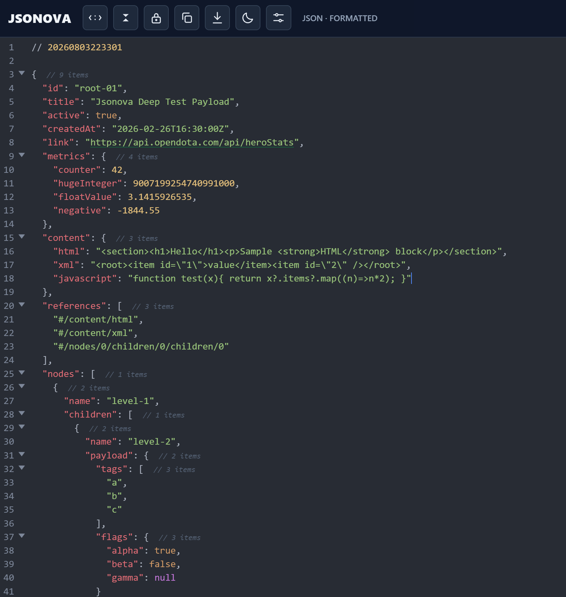
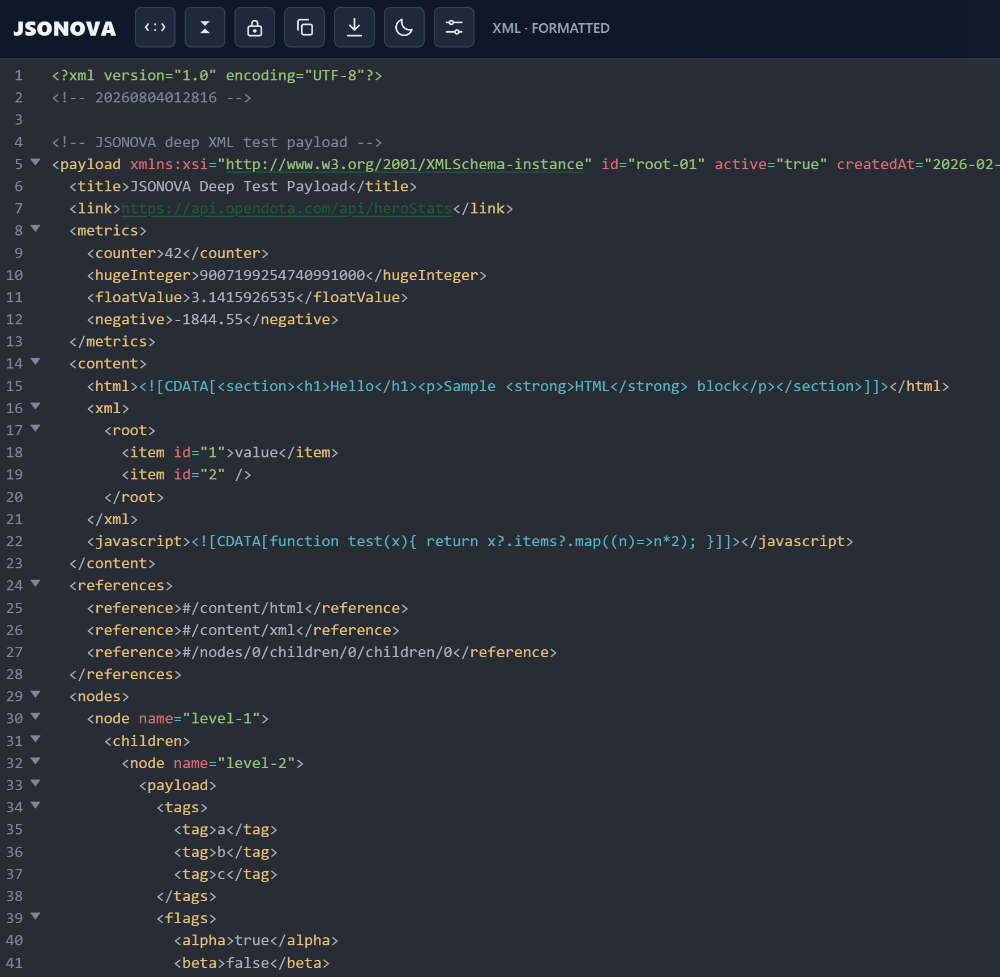
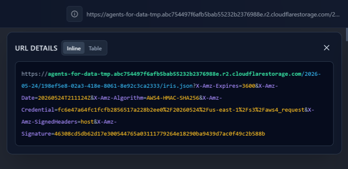
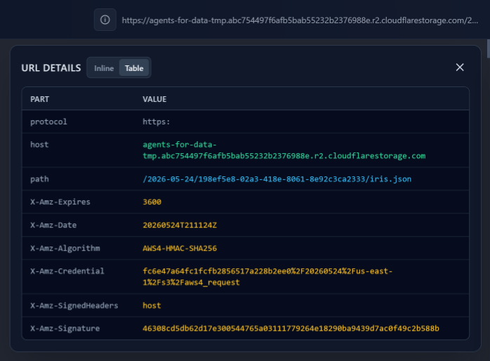

<p align="center">
  
</p>

<p align="center">
  <strong>The static, dependency-free home of the JSONOVA Chrome extension.</strong><br>
  Open structured data where it already lives—then search, fold, inspect, copy, or download it without leaving the tab.
</p>

<p align="center">
  <a href="https://chromewebstore.google.com/detail/lgccmeebjifcbcfpobkkcpoehgciamji"><strong>Add JSONOVA to Chrome</strong></a>
  ·
  <a href="./privacy.html">Privacy</a>
  ·
  <a href="https://github.com/JSONOVA/jsonova-json-formatter-ext">Extension source</a>
</p>

## See the extension, not a mockup

The landing page is built around the real JSONOVA interface. It shows the same formatter, navigation controls, themes, URL inspection, and XML support available in the extension.

<p align="center">
  
</p>

## From raw response to useful workspace

JSONOVA activates when Chrome opens valid JSON or XML. Regular pages stay untouched; structured documents become a focused workspace in the current tab.

1. **Open** a web response or a local `.json` / `.xml` file.
2. **Understand** it with syntax highlighting, folding, structure counts, global search, and URL details.
3. **Act** without context switching—follow links, copy content, or download the document with a generated filename.

### Built for everyday inspection

- Formatted and raw views for JSON and XML
- Fast navigation through deeply nested documents
- Search, line numbers, wrapping, fold controls, and structure sizes
- Clickable HTTP and HTTPS values that open in a new window
- Inline and table views for protocol, host, path, and query parameters
- Light, dark, and live system themes
- Local preferences and custom CSS
- Local-file support after Chrome file access is enabled

## JSON and XML use the same workflow

No conversion step and no second application. Both formats keep the controls you use for inspection while preserving format-specific syntax.

<details>
  <summary><strong>View the full JSON interface</strong></summary>
  <br>
  
</details>

<details>
  <summary><strong>View the full XML interface</strong></summary>
  <br>
  
</details>

## Read the URL behind the response

Long API URLs become easier to scan. JSONOVA can keep the URL together with color-coded parts or separate protocol, host, path, and each query parameter into a table.

<p align="center">
  
</p>

<p align="center">
  
</p>

## Privacy is part of the product

JSONOVA processes the current document in the browser. It does not send JSON/XML content, URLs, preferences, or custom CSS to JSONOVA-controlled servers, analytics, or advertising services.

- Read the styled [privacy page](./privacy.html).
- Review the canonical [English privacy policy](./privacy-policy.en.md).

## Work on the landing page

The repository root is the deployable site. There is no build step, package manager, or runtime dependency.

```powershell
git clone https://github.com/vyach-vasiliev/jsonova.git
cd jsonova
python -m http.server 4173
```

Open `http://127.0.0.1:4173/`.

### Repository map

```text
.
├── index.html              # Product landing page
├── styles.css              # Responsive visual system
├── script.js               # Preview tabs and reveal behavior
├── privacy.html            # Styled privacy page
├── privacy-policy.en.md    # Canonical policy source
└── assets/                 # Product and README visuals
```

## Deploy

Serve the repository root with any static host. Keep `index.html`, `styles.css`, `script.js`, `privacy.html`, `privacy-policy.en.md`, and `assets/` together; all site references are relative.
